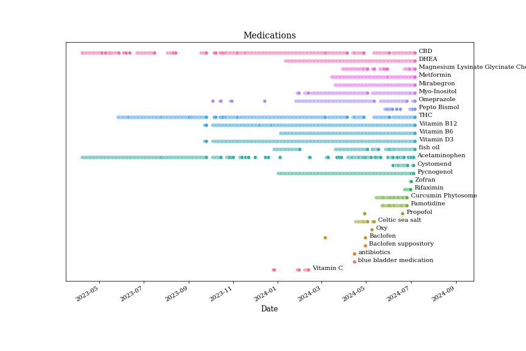
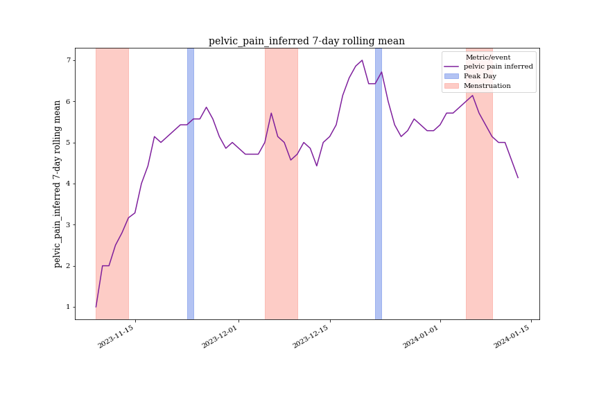

These notebooks help you gain insights about your health and share summaries with your doctors.

### Setup

1. Track your symptoms in a Google sheet like [this](https://docs.google.com/spreadsheets/d/1ZZP9MqIlzUlu6MgsLTdogAXfqFi91Oi59sjLXQch_qQ/edit#gid=1102650863). You can track different symptoms than the ones in the example, the code can be adjusted.

2. Set up a Google Sheets API authentication [here](https://console.cloud.google.com/apis/credentials?pli=1), and copy your JSON key into a directory called "keys".  Paste the key's path in constants.ipynb. Also see [this page](https://console.cloud.google.com/iam-admin/serviceaccounts).  Share your Google spreadsheet with your service account email (e.g., read-spreadsheet@<project-name>.iam.gserviceaccount.com).

3. Pip install the required packages (requirements.txt) or manually install the packages used in the notebooks.  Sorry I didn't use a virtual environment - requirements.txt lists all packages I installed on my laptop. :/

4. Make a directory called "output" to store images and HTML files.

5. Adjust cleaning and analysis code if you tracked different symptoms than in the example spreadsheet.

6. Run 3_parent.ipynb to generate insights!

### Example insights
1. Menstrual cycle charting (based on cervical mucus).

2. Medications taken recently.

3. Pelvic pain in relation to menstrual cycle.

4. Diets

5. Summary to share with doctors: [link](https://kroesler.com/health/analysis_for_drs.html).

### Feedback
Please reach out to katroesler@gmail.com with any feedback or questions.  I'd be happy to run the code for you or update it to meet your needs.
